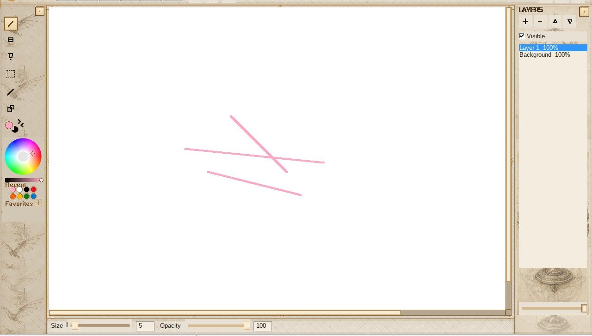
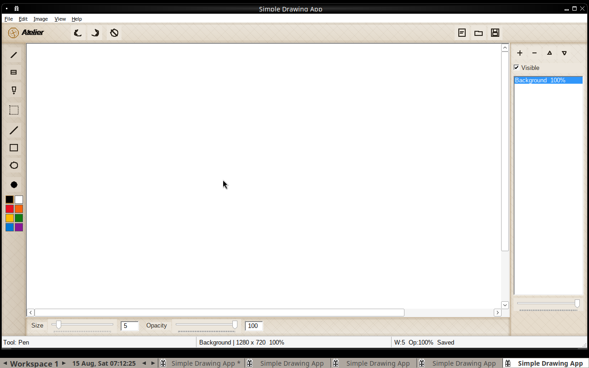
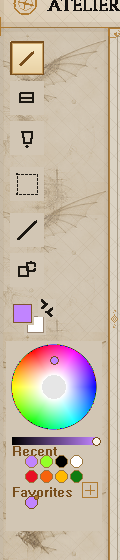
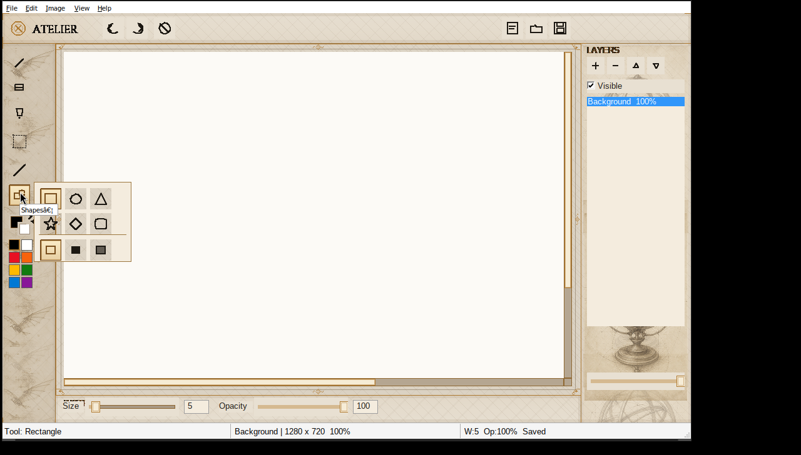
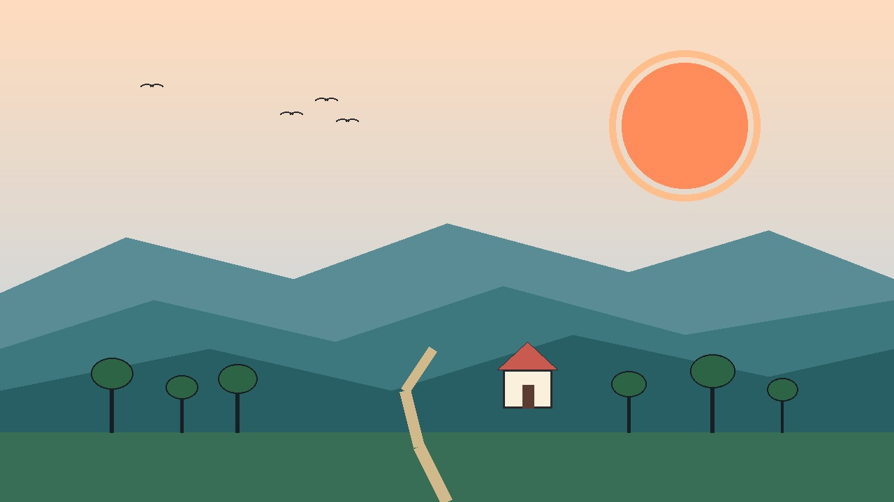

# Simple Drawing App

**Atelier** — a lightweight native drawing app for Windows (**Win32** + **GDI+**).

Pen, eraser, fill, shapes, layers, and an HSV color well — no Electron, no heavy frameworks.

<p align="center">
  
</p>

<p align="center">
  
</p>

### Color well & shapes

<p align="center">
  
  &nbsp;
  
</p>

### Sample artwork

<p align="center">
  
</p>

### Demo

<video src="docs/media/demo.mp4" controls width="860"></video>

> If the video does not play inline on GitHub, open [`docs/media/demo.mp4`](docs/media/demo.mp4).

## Features

- **Tools:** Pen, Eraser, Flood Fill, Select, Line, Shapes flyout (rect, ellipse, triangle, star, diamond, round-rect)
- **Shape paint modes:** stroke / fill / both — FG stroke, BG fill; hold `Alt` = fill-only, `Ctrl` = stroke+fill while drawing
- **Color:** HSV disc + value strip, Recent + Favorites (persisted), FG/BG chips, swap (`X`), system picker from disc center
- **Floating palette:** `Tab` collapses the tools rail and undocks the color well as a draggable panel
- **Chrome:** Firefox-style top bar (File / Edit / Image / View / Tools / Help), custom caption buttons on Windows, collapsible rail / layers / bottom bar (`Tab`, `F9`, `F8`)
- **Opacity & width:** sliders, edit boxes, mouse wheel / `Shift`+wheel, `[` `]`; **Tools → Brush Size** presets (Fine / Medium / Bold)
- **Selection:** marquee, move, Delete; Cut / Copy / Paste (`Ctrl+X/C/V`)
- **Zoom:** `Ctrl`+wheel, View menu (`Ctrl++` / `Ctrl+-` / `Ctrl+0` / Fit)
- **Layers:** add / delete / reorder, rename (double-click or `F2`), visibility, per-layer opacity; Background pinned at bottom; drawing starts on Layer 1
- **Undo / Redo** (full layer-stack snapshots, capped — up to 30 steps; fewer on large canvases)
- **New / Clear** with unsaved-change prompts; **Save / Open / Export As** PNG, JPG, BMP
- **Fixed document canvas** (default 1280×720) + scrollable viewport; **Canvas Size…** (`Ctrl+E`)
- **Shortcuts:** `B` Pen · `E` Eraser · `G` Fill · `M` Select · `L` Line · `U` Shapes · `X` Swap FG/BG · `F1` Help
- **Status bar tips:** active-tool hints + modifiers; cursor document coordinates while hovering the canvas
- **Look:** Bronze & parchment atelier chrome, Cinzel + DM Sans (OFL), fresco panels, idle compass motion
- **View preferences:** paste at view origin, selection veil, canvas-shrink warning, reopen last document, autosave recovery, canvas grid + spacing (8/16/32/64), snap to grid; pen width (`features.ini`)
- **Session:** up to 5 recent documents in `session.ini`; **Open Last** (`Ctrl+Shift+O`), **File → Open Recent**, optional startup reopen; dirty canvases autosave to `autosave.png` for crash recovery

## Requirements

| Item | Detail |
|------|--------|
| OS | Windows 10 or later |
| IDE | Visual Studio 2022 (v143 toolset) |
| SDK | Windows 10 SDK |

## Build

```bash
git clone https://github.com/badxv/SimpleDrawingApp.git
cd SimpleDrawingApp
```

1. Open `SimpleDrawingApp.sln` in Visual Studio  
2. Select **Debug | x64** (or **Release | x64**)  
3. Build (**Ctrl+Shift+B**) or run (**F5**)

Linux (MinGW cross-compile + Wine smoke):

```bash
./scripts/build-linux.sh
```

CI runs the same script on every push / PR to `main` (GitHub Actions → **Build**).

## Usage

| Action | How |
|--------|-----|
| Draw | **Pen** (`B`), drag on the canvas |
| Erase | **Eraser** (`E`) |
| Fill | **Fill** (`G`), click a region |
| Line / shapes | **Line** (`L`) or **Shapes** (`U`) → flyout; click-drag (`Shift` constrains) |
| Select / move | **Select** (`M`), marquee; drag inside to move |
| Color | HSV disc (LMB = FG, RMB = BG), Recent / Favorites, or FG/BG chips |
| Swap FG/BG | `X` or swap button |
| Width / opacity | Sliders, boxes, wheel / `Shift`+wheel, `[` `]`, or **Tools → Brush Size** (Fine 2 / Medium 8 / Bold 20) |
| Panels | `Tab` tools · `F9` layers · `F8` size/opacity bar |
| Zoom | `Ctrl`+wheel or **View** menu |
| Layers | Right panel: `+` / `-` / Up / Dn, Visible, opacity; double-click or `F2` to rename |
| Undo / Redo | Buttons, menu, or `Ctrl+Z` / `Ctrl+Y` |
| Save / Open | Buttons, menu, or `Ctrl+S` / `Ctrl+O` (re-save skips the dialog when a path is known; **Save As** = `Ctrl+Shift+S`; **Export As** = `Ctrl+Shift+E`, copy only) |
| Canvas size | **Image → Canvas Size…** or `Ctrl+E` |
| Shortcuts list | **Help → Keyboard Shortcuts** or `F1` |

## Project structure

```text
SimpleDrawingApp/
├── LICENSE
├── README.md
├── SimpleDrawingApp.sln
├── .github/workflows/build.yml   # MinGW CI
├── docs/media/                   # README screenshots + demo
├── fonts/ / artwork/             # OFL fonts + panel art
├── scripts/build-linux.sh        # MinGW cross-build
└── SimpleDrawingApp/
    ├── SimpleDrawingApp.cpp      # WinMain entry + message loop
    ├── AppWindow.*               # Main WindowProc / chrome input
    ├── AppCommands.*             # Menu / toolbar / layer commands
    ├── AppShell.*                # Status, title, tools, layer list
    ├── AppViewport.*             # Canvas child window
    ├── AppCanvas.* / AppStroke.* # Zoom, scroll, stroke / shapes
    ├── AppDocument.*             # New / open / save / undo
    ├── AppSelection.*            # Marquee, clipboard
    ├── AppFeatureFlags.*         # View preferences (INI)
    ├── EventBus.* / AtelierRaii.*
    ├── UiChrome* / UiToolbar.* / UiPaletteFloat.* / UiShapeFlyout.*
    ├── AtelierPalette.*          # HSV disc, Recent / Favorites
    ├── AtelierControls.*         # Sliders, scrollbars
    ├── AtelierFonts.* / AtelierArtwork.*
    ├── LayerStack.* / LayerHistory.*
    ├── DrawingTools.* / FileManager.* / ColorPicker.*
    └── Resource.h / .rc
```

## Roadmap

- [x] Modern toolbar + status bar
- [x] Undo / redo, eraser, flood fill
- [x] Fixed canvas + scroll viewport + Canvas Size
- [x] Shapes flyout + stroke / fill / both modes
- [x] Selection, zoom, clipboard
- [x] Layers + transparency (Background pinned)
- [x] HSV palette + Recent / Favorites + floating well
- [x] Collapsible panels + Firefox-style top menus
- [x] Custom in-client titlebar (Windows)
- [x] Atelier chrome, fonts, fresco motion
- [x] Modular C++ layout (App* / Ui* modules)
- [x] View preferences + MinGW CI

## Contributing

Issues and pull requests are welcome. Prefer small, focused changes.

## License

[MIT](LICENSE) — see `LICENSE` for the full text.

Bundled fonts (Cinzel, DM Sans) remain under the [SIL Open Font License](fonts/NOTICE.txt).
